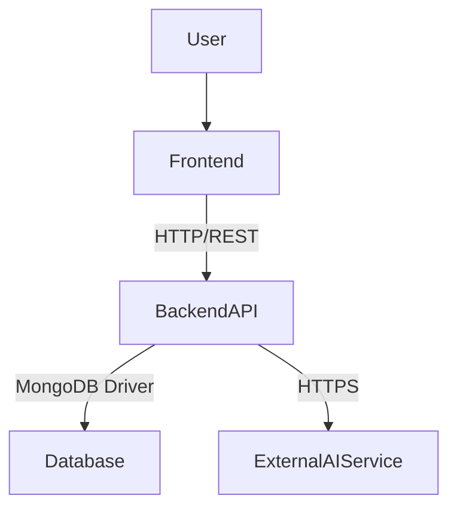
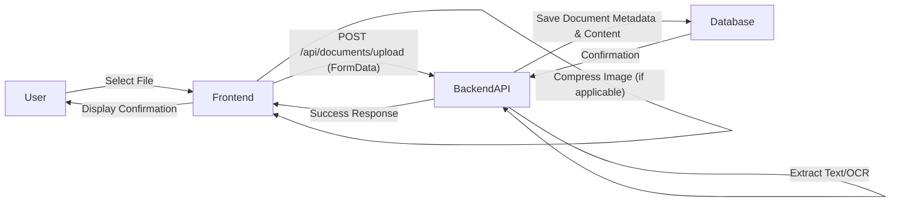
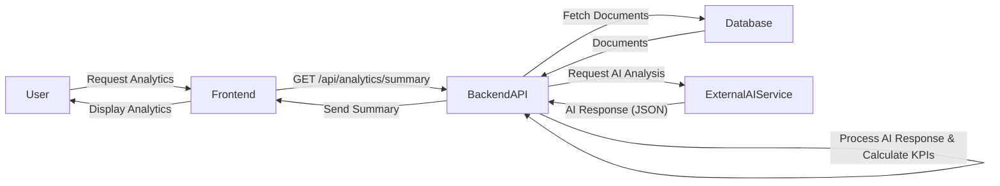
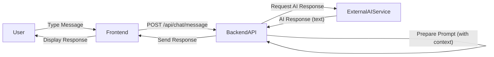

# Architecture Overview

This document outlines the high-level architecture of the Enterprise Project, detailing its main components and their interactions.

## High-Level Components

The system is primarily composed of three main logical components:

1.  **Frontend (Client Application)**: A React-based single-page application (SPA) that provides the user interface.
2.  **Backend API (Server)**: A Node.js/Express application that serves as the central hub for business logic, data persistence, and integration with external services.
3.  **Database**: MongoDB, used for storing application data.
4.  **External AI Service**: Google Gemini API, used for advanced AI functionalities.

## Component Breakdown and Responsibilities

### 1. Frontend (React Application)

-   **Technology**: React, Redux Toolkit, React Router, Tailwind CSS.
-   **Responsibilities**:
    -   User Interface (UI) rendering.
    -   Handling user interactions.
    -   Managing client-side state (Redux).
    -   Making API requests to the Backend API.
    -   Client-side validation and basic data formatting.
    -   Image compression before upload.

### 2. Backend API (Node.js/Express)

-   **Technology**: Node.js, Express.js, Mongoose, Multer, bcryptjs, jsonwebtoken.
-   **Responsibilities**:
    -   Exposing RESTful API endpoints for the frontend.
    -   Implementing core business logic (e.g., user management, document processing).
    -   Authentication and Authorization (JWT-based).
    -   Interacting with the MongoDB database.
    -   Handling file uploads (using Multer for in-memory processing).
    -   Performing text extraction from various document types (PDF, DOCX, TXT, MD).
    -   Performing OCR on image files (JPG, JPEG, PNG) using Tesseract.js.
    -   Integrating with the Google Gemini API for AI-powered features.
    -   Error handling and logging.

### 3. Database (MongoDB)

-   **Technology**: MongoDB.
-   **Responsibilities**:
    -   Persistent storage for application data (users, documents).
    -   Provides flexible, schema-less document storage.

### 4. External AI Service (Google Gemini API)

-   **Technology**: Google Gemini API.
-   **Responsibilities**:
    -   Providing advanced natural language processing capabilities.
    -   Generating analytics summaries (sentiment, keywords, business insights).
    -   Powering the conversational AI chatbot.

## Data Flow Examples

### Document Upload Flow

### Analytics Generation Flow

### Chatbot Interaction Flow

